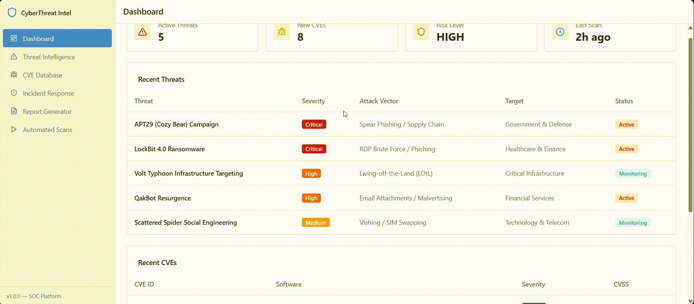

# 🔐 AI Cybersecurity Intelligence System

An AI-powered cybersecurity threat intelligence platform that automatically detects cyber threats, analyzes vulnerabilities (CVEs), recommends mitigation strategies, and generates structured security reports using AI.

This project simulates a real **SOC (Security Operations Center)** dashboard with automated scanning and reporting.

---

## 📌 What This Project Does (Simple Explanation)

Instead of manually searching for cyber threats and vulnerabilities, this system:

- Finds latest cyber threats (malware, ransomware, APTs)
- Identifies new CVEs affecting software
- Assesses risk level
- Suggests incident response actions
- Generates a professional cybersecurity report  
- **All in one application**

---

## 🖥️ Application Screens

### 🏠 Dashboard – Security Overview
- Shows active threats, CVEs, and risk level
- Displays recent threats with severity and status

### ▶️ Automated Daily Scan
- One-click scan execution
- Automatically updates threats and CVEs

### 📜 Scan History
- Stores previous scan results
- Shows scan time, duration, and findings

### 📄 AI Threat Intelligence Report Generator
- Generates structured cybersecurity reports
- Ready for SOC teams and management

### 🔍 Threat Analysis (Inside Report)
- Detailed threat descriptions
- Severity, attack vector, and targeted industries

---

## ⚙️ How It Works (Behind the Scenes)

### Threat Analyst Module
Fetches latest cyber threats using external intelligence sources.

### Vulnerability Research Module
Collects newly published CVEs and analyzes risk.

### Incident Response Advisor
Suggests mitigation and remediation steps.

### Report Generator
Combines all findings into a structured AI-generated report.

---

## 🧰 Tech Stack

**Frontend:** - HTML, CSS, JavaScript 

**Backend:** - Python 

**AI Frameworks:** - CrewAI, LangChain 

**LLM:** - Groq (LLaMA 3-70B) 

**APIs:** - EXA API 

**Environment Management:** - python-dotenv 

**Architecture:** - Multi-Agent AI System

---

## ▶️ How to Run the Project

### 1️⃣ Clone Repository
```bash
git clone https://github.com/<your-github-username>/ai-cybersecurity-intelligence.git
cd ai-cybersecurity-intelligence
```
### 2️⃣ Install Dependencies
pip install -r requirements.txt
 or
npm install

### 3️⃣ Add Environment Variables
Create a .env file:
API_KEY=your_api_key_here

### 4️⃣ Run the Application
npm start
  or
python app.py

### 🏢 Use Cases

- Security Operations Center (SOC) Teams
- Enterprises
- Cybersecurity Researchers
- Students & Academic Projects

### 🚀 Future Enhancements

- User authentication
- Email alerts for critical threats
- Cloud deployment (AWS)
- MITRE ATT&CK mapping

## 🎥 Project Demo



### ⭐ Acknowledgement
This project was developed as part of my learning journey in **AI-powered cybersecurity systems and multi-agent AI architectures.**

It is inspired by real-world **Security Operations Center (SOC)** tools and AI-driven threat intelligence platforms.

If you find this project useful or interesting, feel free to ⭐ **star the repository** — it really helps and motivates further improvements.

**Happy Learning!** 😊

